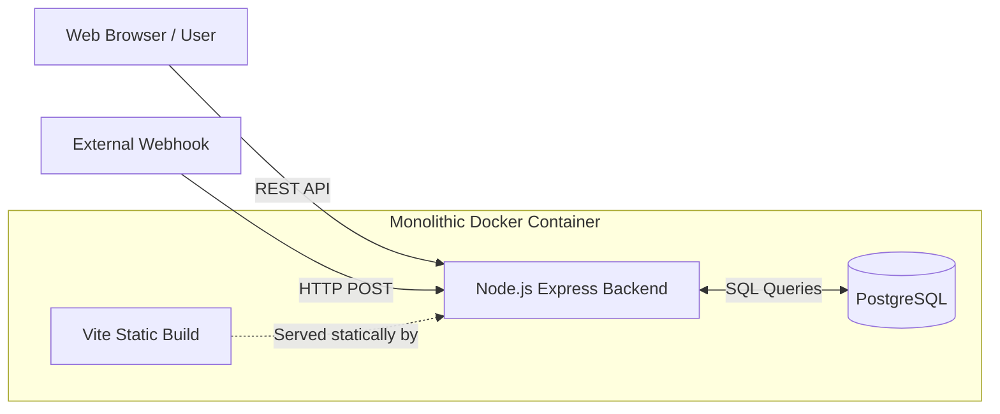
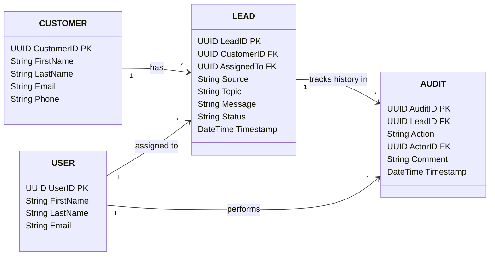

# Leadify

This project contains a React+TypeScript frontend, an Express.js backend, and a PostgreSQL database, all configured to run inside a **single Docker container**.

# Architecture



### How it works

* **Frontend UI**: A React application built with Vite and Tailwind CSS that communicates with the backend via REST endpoints to view, update, and manage leads.
* **Backend API**: A Node.js and Express server that handles API requests, validates payloads (via Zod), and persists data. In production, it also serves the pre-compiled frontend static files.
* **External Integrations**: The backend exposes webhook endpoints (e.g., `/webhook/meta-lead`) to securely ingest incoming lead data from external platforms like Meta.
* **Database**: A PostgreSQL database maintaining normalized records for `User`, `Customer`, `Lead`, and an `Audit` trail for tracking history.
* **Containerization**: For deployment simplicity, the database, backend, and frontend build are bundled into a single Docker image and run together using Supervisor.

# Database Schema



# Local Setup

The recommended way to run the project is using Docker, which eliminates the need to install PostgreSQL locally.

### 1. Docker Setup (Recommended)

You can run the entire monolithic application (Database + Backend + Frontend) with a single Docker container.

```bash
# Build the image
docker build -t leadify .

# Run the container
docker run -d -p 3000:3000 -p 5432:5432 --env-file .env --name leadify leadify
```

The application will be available at `http://localhost:3000`. The container automatically initializes and seeds the database on the first run.

### 2. Local Development (Backend + Frontend)

For active development, you should run the database in Docker, but run the frontend and backend locally so you can benefit from hot-reloading.

**Prerequisites**
* Node.js v20+
* Docker (for the database)

**Start the Database via Docker:**
```bash
docker run --name leadify-db -e POSTGRES_USER=leadify_admin -e POSTGRES_PASSWORD=your_secure_password -e POSTGRES_DB=leadify_prod -p 5432:5432 -d postgres:15
```

**Configuration:**
Create a `.env` file in the root directory:
```env
DB_USER=leadify_admin
DB_PASSWORD=your_secure_password
DB_NAME=leadify_prod
DB_PORT=5432
DB_HOST=localhost
PORT=3000
```

**Install Dependencies & Seed Database:**
```bash
# Install and seed backend
cd backend
npm install
npm run seed

# Install frontend
cd ../frontend
npm install
```

**Run Development Servers:**
```bash
# Terminal 1: Start backend dev server
cd backend
npm run dev

# Terminal 2: Start frontend dev server
cd frontend
npm run dev
```

The frontend will be running at `http://localhost:5173` and the API at `http://localhost:3000`.

# Deployment

1. **Build**: The project uses a monolithic Dockerfile that bundles PostgreSQL, builds the Vite frontend, and builds the Node backend.
   ```bash
   docker build -t leadify .
   ```
2. **Environment**: Ensure your `.env` file is present in the root directory with your production database credentials and port configuration. Avoid checking sensitive credentials into version control.
3. **Deploy**: Start the container, mapping the application and database ports.
   ```bash
   docker run -d -p 3000:3000 -p 5432:5432 --env-file .env --name leadify leadify
   ```

### Notes

* No manual migrations or seeding steps are required post-deployment. The container's `entrypoint.sh` script automatically checks if the database is initialized on startup. If it is empty, it automatically handles PostgreSQL role/database creation and runs the `npm run seed` script before starting the backend via Supervisor.

# Trade-offs

The current architecture intentionally favors simplicity and low operational overhead.

* **Single Docker container**
  The Node.js backend, PostgreSQL, and Vite build run in one container under `supervisord`. This keeps deployment simple with a single container, but limits independent scaling because the application and database are coupled.

* **Node.js serves the frontend**
  Express serves the built React application via `express.static()`. This avoids introducing Nginx or a CDN, keeping the setup lightweight, but makes Node responsible for static asset delivery.

* **Simplified authentication**
  Authentication is intentionally omitted for now. A basic user table is populated to support the application's user flow without adding authentication infrastructure.

* **No real-time lead updates**
  WebSockets were intentionally avoided because the application is currently hosted on a free tier where keeping persistent connections may add unnecessary resource overhead.

# Scaling Considerations

The main scaling risks are around webhook throughput, database connections, and stale client state.

* **Synchronous webhook processing** — `backend/src/routes/webhook.ts`
  Meta webhooks are processed synchronously, including customer creation and lead/audit database writes. A sudden spike in webhook traffic could exhaust the PostgreSQL connection pool and increase response times or cause webhook timeouts.

* **Stale lead data** — `frontend/src/components/views/LeadList.tsx`
  The lead list currently relies on manual refreshes and local state updates. With multiple agents working concurrently, users may temporarily see outdated lead statuses.

* **Default database connection pool** — `backend/src/db.ts`
  `pg.Pool` currently uses its default configuration. As traffic grows, the pool could become a bottleneck; when scaling the backend horizontally, excessive connections could also put additional pressure on PostgreSQL.

# Future Improvements

* **Separate application and database services**
  Move PostgreSQL into a dedicated service/container with persistent storage, and run the Node.js application separately so backend instances can scale independently behind a load balancer.

* **Queue webhook processing**
  Introduce Redis with a queue such as BullMQ. The webhook endpoint can validate the request, enqueue the event, and return `202 Accepted`, while background workers process database operations asynchronously.

* **Add real-time updates**
  Introduce WebSockets or SSE to push lead and status changes to connected clients, reducing stale data and eliminating the need for manual refreshes.

* **Add proper authentication and authorization**
  Introduce user authentication and role-based access control once the application moves beyond the current simplified setup.
